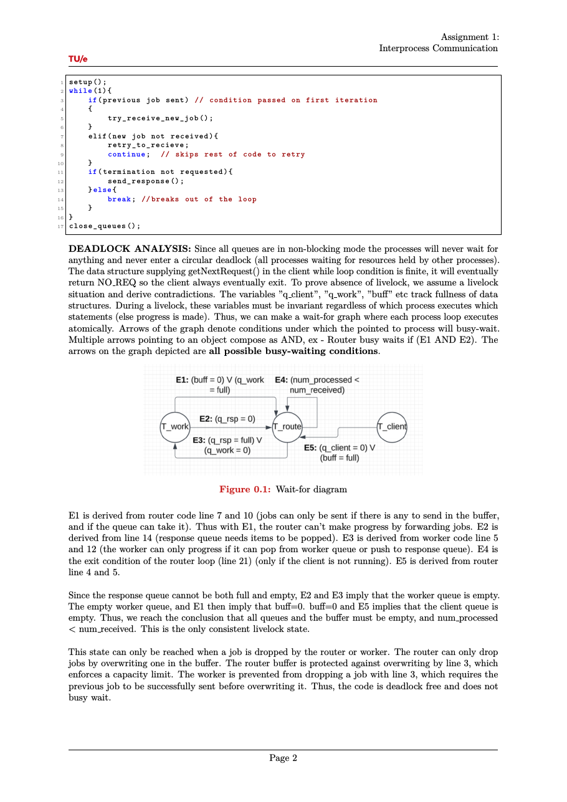
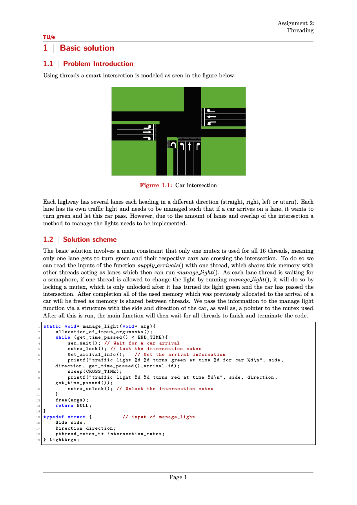

# Operating Systems (2INC0)

Coursework for the Operating Systems course (2INC0) at TU Eindhoven, written in C on
Linux. The three graded assignments cover the core concurrency mechanisms of an operating
system: interprocess communication with message queues, thread synchronization with
semaphores and mutexes, and producer-consumer coordination with condition variables. Each
assignment has a short group report (co-authored with two teammates) documenting the
design and, for the harder ones, a proof that the solution is free of deadlock. The rest
of the repository is C practice: a fork-based process exercise, weekly exercises, quizzes,
and the slide decks from C workshops given during the course.

## Assignments

### Interprocess communication

A router-dealer job system built on POSIX message queues (`mq_open`, `mq_send`,
`mq_receive`, linked with `-lrt`). A client generates jobs and pushes them onto a request
queue. A router-dealer process receives jobs into a circular buffer and forwards them to
worker processes for one of two services, then returns results. All queues run in
non-blocking mode, and the router coordinates shutdown by sending kill messages to the
workers once every job is processed. The report includes a wait-for graph and a
busy-waiting argument showing the design cannot deadlock or livelock.



### Threading

A smart traffic intersection modeled with pthreads. Each of the 16 lanes is a thread with
its own traffic light, signaled by a semaphore when a car arrives. A single intersection
mutex enforces the safety rule that only one lane is green at a time: a lane thread waits
on its semaphore, locks the mutex, turns green, lets its car pass, then unlocks. An
advanced variant relaxes this to allow non-conflicting lanes to be green together.



### Condition variables

A producer-consumer system where multiple producers generate numbered items into a bounded
shared buffer and consumers take them out, with correctness enforced by a mutex and
condition variables (producers wait while the buffer is full, consumers wait while it is
empty). The item count and buffer size are configurable in `prodcons.h`.

## Repository structure

```
interprocess/          IPC assignment: client, router_dealer, workers, report, Makefile
threading/             traffic intersection assignment, report, Makefile
condition-variables/   producer-consumer assignment and report
homework/              fork-based process precedence exercise (processes.c)
weekly-practice/       weekly C and concurrency exercises
quizes/                quiz solutions
presentations/         C workshop slide decks (pointers, bit ops, strings, malloc)
```

## Building and running

Each assignment has its own Makefile. For example, the IPC assignment:

```
cd interprocess
make            # builds router_dealer, client, worker_s1, worker_s2
```

The threading assignment builds the same way and prints, for each car, the lane and time
its light turned green:

```
traffic light <side> <direction> turns green at time <t> for car <ID>
```

## Technologies

C, POSIX threads (pthreads), semaphores, mutexes, condition variables, POSIX message
queues, and the fork/wait process API, on Linux with gcc.
